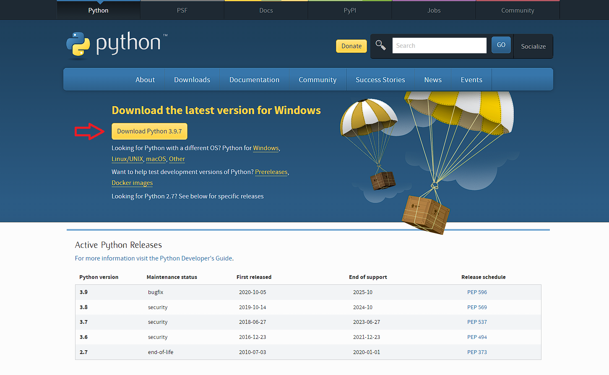
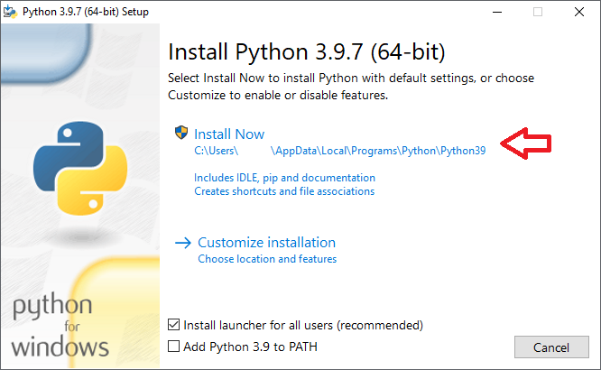
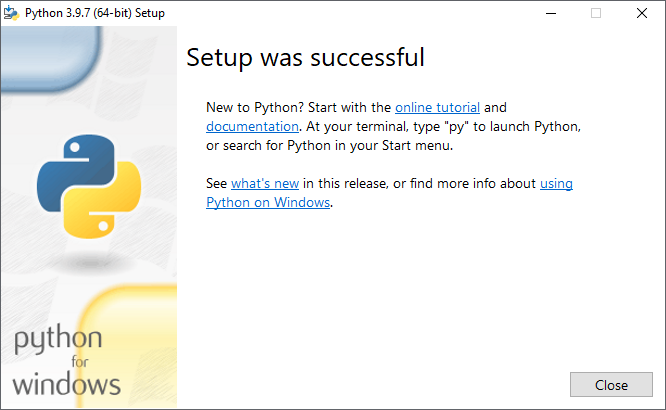
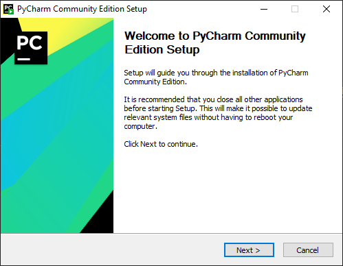
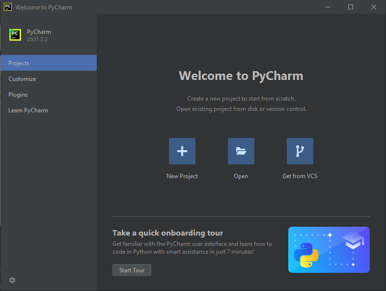
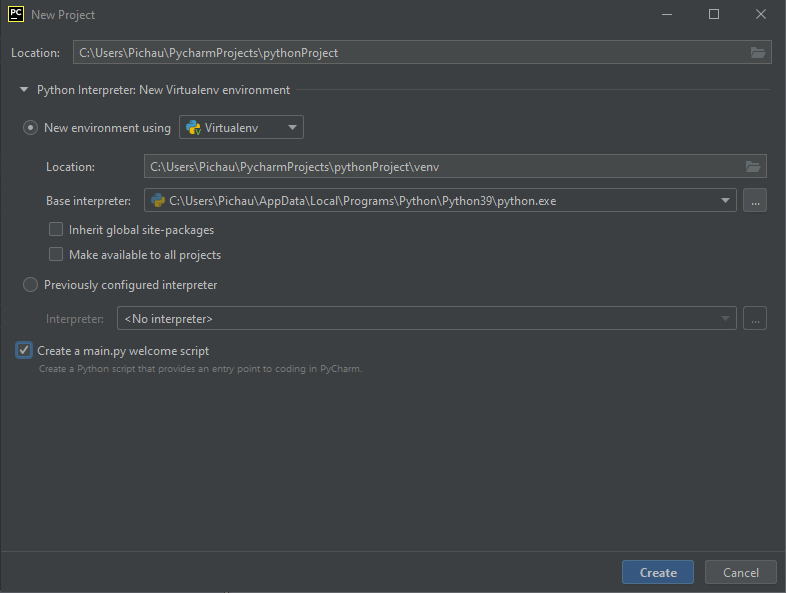

# Instalação do interpretador Python
Para instalar o interpretador Python é necessário acessar o site [python.org](https://www.python.org/downloads/).

Na página inicial, baixe o instalador como na imagem abaixo.

Terminado o download, abra o executável e clique no botão 'Install Now'.

Ao fim do processo de instalação, feche o programa.

# Configuração do ambiente de desenvolvimento

Neste treinamento, foi feita a escolha por utilizar a IDE PyCharm.

Efetue o download da versão Community no site [jetbrains.com](https://www.jetbrains.com/pycharm/download/#section=windows).

Uma vez que o processo de download tenha terminado, abra o executável.

Siga os passos sugeridos pelo instalador até que o procedimento termine.

Após a conclusão da instalação, abra o PyCharm. Na tela inicial, crie um novo projeto.

Na próxima tela, apenas clique em *create*.

O projeto será aberto com um arquivo *main.py*. Apague todo o conteúdo dentro dele.