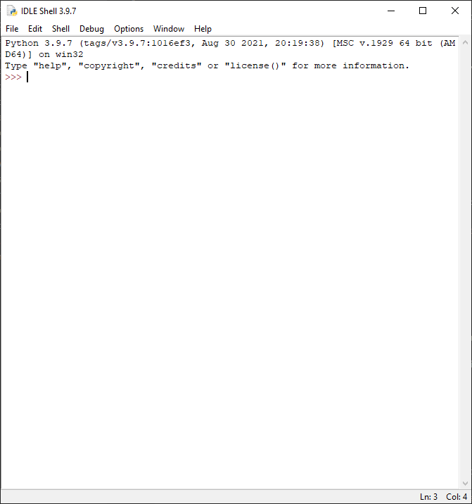

# Instalação do interpretador Python
Para instalar o interpretador Python é necessário acessar o site [python.org](https://www.python.org/downloads/).

Na página inicial, baixe o instalador como na imagem abaixo.

Terminado o download, abra o executável e clique no botão 'Install Now'.

Ao fim do processo de instalação, feche o programa.

# Configuração do ambiente de desenvolvimento

Após a instalação, procure pelo programa IDLE e o abra.

É nele que serão interpretados os códigos criados nesse treinamento.

Pronto! Configurações concluídas! Agora vamos dar os [primeiros passos](https://github.com/harielribeirof/treinamentoPython/blob/main/02%20-%20primeiros%20passos%20e%20comentarios/primeiros_passos.md).