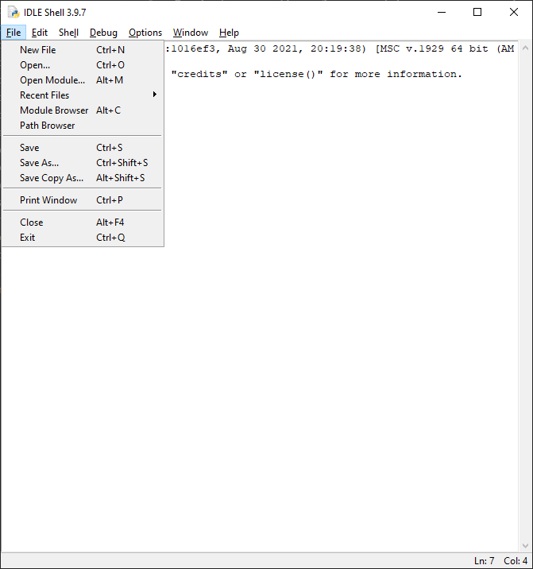
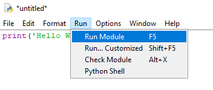

# Primeiros passos

Terminadas as configurações necessárias, agora vamos criar o nosso primeiro código. Para isso, é necessário criar um arquivo .py antes.

Com o IDLE aberto, crie um novo arquivo.



Feito isso, será aberto um arquivo em branco. Como primeiro teste, faremos um print do famoso "Hello World!". Primeiro digite o código abaixo no arquivo:

```python
print('Hello World!')
```

Agora, rode o programa.



Irá aparecer um pedido para que o arquivo seja salvo, faça-o em um local de sua preferência. Depois disso, será apresentado na tela a saída do programa.


## Comentários